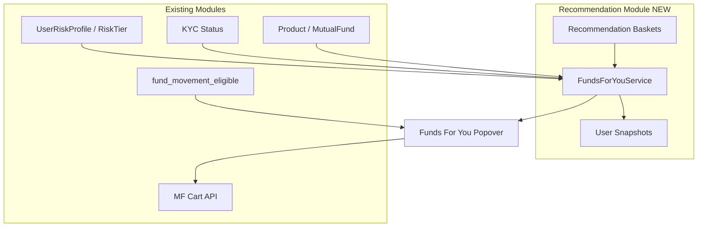
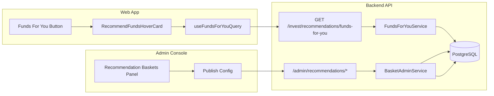
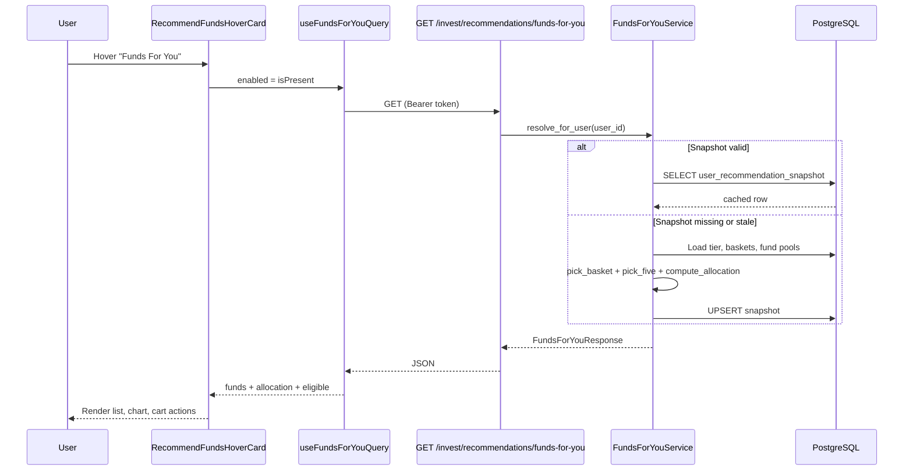
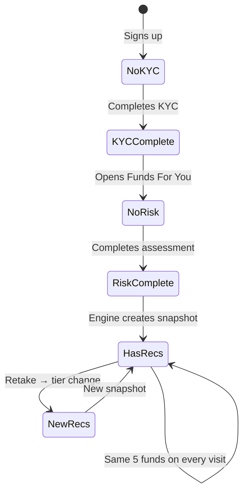
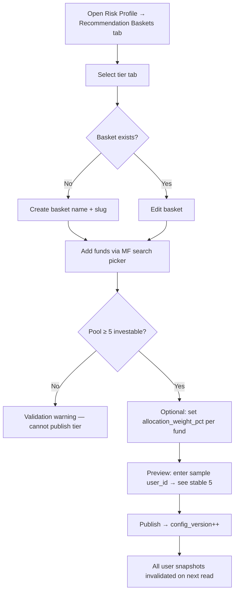
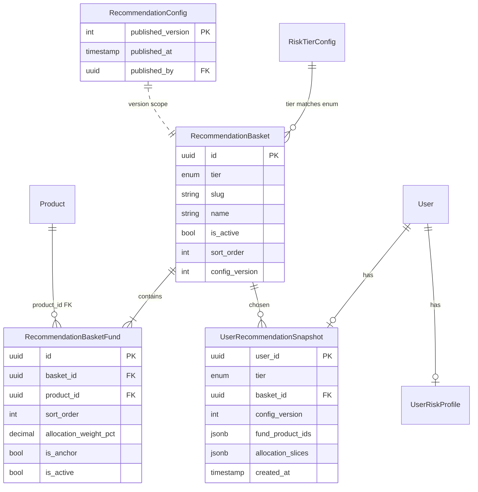
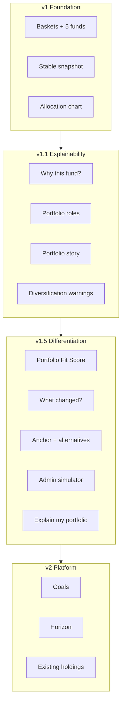

# Funds For You — Fund Recommendation Engine

> **Core module specification** for Zynd's personalized fund recommendation platform — from rule-based tier baskets (v1) to an explainable **portfolio-built-for-you** experience (v1.1+).

| Field | Value |
| ----- | ----- |
| **Module ID** | `recommendations.funds-for-you` |
| **Status** | Planned — UI shell complete (dummy data); backend engine not yet built |
| **Last updated** | August 2026 |
| **Primary surface** | `Web/src/components/dashboard/recommend-funds-hover-card.tsx` |
| **Owner** | Product + Platform (Invest) |
| **Product north star** | *"Here's a portfolio built for you — and here's why."* |

---

## Table of contents

1. [Module overview](#1-module-overview)
2. [Problem statement and goals](#2-problem-statement-and-goals)
3. [Scope and boundaries](#3-scope-and-boundaries)
4. [Glossary](#4-glossary)
5. [System architecture](#5-system-architecture)
6. [User journeys and eligibility](#6-user-journeys-and-eligibility)
7. [Admin journeys and configuration model](#7-admin-journeys-and-configuration-model)
8. [Domain model and persistence](#8-domain-model-and-persistence)
9. [Recommendation engine algorithm](#9-recommendation-engine-algorithm)
10. [Backend services and APIs](#10-backend-services-and-apis)
11. [Admin console](#11-admin-console)
12. [Web client integration](#12-web-client-integration)
13. [Security, RBAC, and audit](#13-security-rbac-and-audit)
14. [Caching, performance, and reliability](#14-caching-performance-and-reliability)
15. [Observability and support](#15-observability-and-support)
16. [Implementation phases](#16-implementation-phases)
17. [Testing strategy](#17-testing-strategy)
18. [Rollout and migration](#18-rollout-and-migration)
19. [Operational runbook (admin)](#19-operational-runbook-admin)
20. [Future extensions (post-v1)](#20-future-extensions-post-v1)
21. [File inventory](#21-file-inventory)
22. [Open decisions and success criteria](#22-open-decisions-and-success-criteria)

### Part II — Personalization & explainability

23. [Product philosophy shift](#23-product-philosophy-shift)
24. [Experience pillars and X-factors](#24-experience-pillars-and-x-factors)
25. [Why this fund? — explainability layer](#25-why-this-fund--explainability-layer)
26. [Portfolio story and portfolio roles](#26-portfolio-story-and-portfolio-roles)
27. [Portfolio Fit Score](#27-portfolio-fit-score)
28. [Recommendation change transparency](#28-recommendation-change-transparency)
29. [Explore alternatives and screener bridge](#29-explore-alternatives-and-screener-bridge)
30. [Intelligent baskets — objectives and strategies](#30-intelligent-baskets--objectives-and-strategies)
31. [Anchor + alternatives model](#31-anchor--alternatives-model)
32. [Diversification guardrails](#32-diversification-guardrails)
33. [Admin preview simulator](#33-admin-preview-simulator)
34. [Enriched API contract](#34-enriched-api-contract)
35. [Ask Zynd — Explain my portfolio](#35-ask-zynd--explain-my-portfolio)
36. [Roadmap: v1 → v1.1 → v1.5 → v2](#36-roadmap-v1--v11--v15--v2)
37. [Future personalization dimensions](#37-future-personalization-dimensions)

---

## 1. Module overview

**Funds For You** is Zynd's investor-facing entry point for **curated mutual fund recommendations**. It is not a generic fund screener or search surface. It is a **rule-based recommendation module** where:

1. **Admins** configure **multiple fund baskets per risk tier** (e.g. three distinct Moderate baskets).
2. **Investors** who complete **KYC** and **risk assessment** receive a **personalized, stable set of exactly 5 funds** plus an **asset allocation breakdown** (donut chart).
3. Recommendations remain **deterministic per user** until the investor's risk tier changes or an admin **publishes a new configuration version**.

### What exists today

| Layer | State |
| ----- | ----- |
| **Web UI** | Production-quality popover: hover bridge, Framer Motion open/close, BorderGlow, Grainient background, 5-fund list, allocation donut + chip swiper, Add to cart footer — all driven by **dummy data** |
| **Risk profile** | Full assessment flow, `UserRiskProfile.tier`, tier config in `risk_tier_config` |
| **MF catalog** | `Product`, `MutualFund`, category curation (`category_curation_service.py`) — browse/invest catalog, not tier baskets |
| **Cart** | `useMfScreenerCartDrop` — working cart upsert; **not wired** to Funds For You |
| **Recommendation engine** | **Does not exist** — no tables, services, or APIs |

### Confirmed product decision

**Stable recommendations (not fresh shuffle on every visit).**

The same authenticated user must see the **same basket** and **same 5 funds** across sessions, devices, and popover re-opens until:

- Admin publishes a new `config_version`, or
- User retakes risk assessment and their `RiskTier` changes, or
- Selected basket becomes invalid (< 5 investable funds) and engine falls back per degradation rules.

---

## 2. Problem statement and goals

### Problem

Investors who complete onboarding still face **choice overload** in the MF catalog. Risk profile tells us *how much* risk they can tolerate, but there is no product path from tier → actionable fund picks. The navbar **Funds For You** button promises personalization without a backend to fulfill it.

### Primary goals

1. **Convert risk tier into fund action** — bridge assessment outcome to investable picks in one hover surface.
2. **Give ops full control** — no deploy required to change baskets; admin publishes config.
3. **Build trust through stability** — users don't see a random new list every day; support can explain "why these 5".
4. **Reuse invest infrastructure** — real `product_id`s, cart integration, MF eligibility rules.
5. **Differentiate through explainability** — evolve from "5 funds for your risk category" to "a portfolio built for you, with reasons" (see [Part II](#part-ii--personalization--explainability)).

### Product positioning

| Today (v1 baseline) | Target (v1.1+) |
| ----------------- | -------------- |
| "Here are 5 funds based on your risk profile." | **"Here's a portfolio built for you — and here's why."** |
| Fund list + donut chart | Portfolio story + roles + fit score + per-fund explanations |
| Admin maintains fund lists | Admin designs **investment strategies** with quality guardrails |
| Stable picks (support can explain) | Explanations are a **first-class product feature**, not ops-only |

### Non-goals (v1)

- ML / collaborative filtering / NAV momentum scoring
- Goal-based overlays ("retirement basket")
- Distributor-specific or branch-specific baskets
- SIP amount recommendations or portfolio rebalancing
- Real-time personalization based on existing holdings (v2 candidate)

### Success metrics (product)

| Metric | Target |
| ------ | ------ |
| Popover open → cart add rate | Baseline + uplift vs screener-only |
| KYC/risk completion from popover CTA | Track funnel events |
| Admin time to configure a tier | < 30 minutes for 3 baskets |
| Support tickets "wrong funds shown" | Near zero (stable snapshot + audit) |

---

## 3. Scope and boundaries

### In scope

```
┌─────────────────────────────────────────────────────────────────┐
│                    RECOMMENDATION MODULE (v1)                    │
├─────────────────────────────────────────────────────────────────┤
│  Admin: basket CRUD, fund pool per basket, publish, preview      │
│  Backend: tier resolve → basket pick → 5-fund pick → allocation  │
│  Backend: user snapshot persistence + invalidation rules         │
│  Web: Funds For You popover wired to API + cart + gating states  │
└─────────────────────────────────────────────────────────────────┘
```

### Out of scope (owned by other modules)

| Concern | Owner module |
| ------- | ------------ |
| Risk questionnaire content/scoring | `application/risk_profile/` |
| KYC completion detection | `features/kyc/` + auth user payload |
| MF catalog ingestion, NAV, rules | `application/mf/` |
| Cart checkout, orders, payments | `application/invest/` |
| Category browse curation | `category_curation_service.py` (parallel pattern, not shared tables) |

### Dependency graph



---

## 4. Glossary

| Term | Definition |
| ---- | ---------- |
| **Risk tier** | One of five enum values: `secure`, `conservative`, `moderate`, `growth`, `aggressive`. Stored on `UserRiskProfile.tier`. |
| **Basket** | Admin-defined named collection of MF `product_id`s scoped to a single risk tier. Multiple baskets per tier enable variety without ML. |
| **Fund pool** | Ordered list of funds inside a basket (`recommendation_basket_fund`). Minimum 5 active investable funds required for basket to be valid. |
| **Config version** | Monotonic integer incremented on admin **Publish**. Part of stable selection seed; invalidates all user snapshots on bump. |
| **Snapshot** | Persisted row tying `user_id` → chosen `basket_id`, ordered 5 `product_id`s, allocation slices, `tier`, `config_version`. |
| **Stable shuffle** | Deterministic pseudo-random ordering of pool funds using seeded PRNG from `user_id + basket_id + config_version`. |
| **Allocation slice** | One segment in the donut chart: `{ id, label, value_pct }` e.g. equity 60%, debt 40%. |
| **Block reason** | API field explaining why recommendations are unavailable (`kyc_required`, etc.). |
| **Investable fund** | Product passing lifecycle, admin investability, and empanelled AMC checks (same rules as invest catalog). |
| **Portfolio role** | Semantic label for a fund's job in the 5-fund set: e.g. `growth_engine`, `stability`, `diversifier`, `income_defensive`, `hedge`. |
| **Reason code** | Machine-readable tag explaining why a fund was selected (`risk_tier_match`, `anchor_fund`, etc.). UI maps codes → copy. |
| **Portfolio Fit Score** | 0–100 **recommendation-fit** score (not return prediction): risk alignment, diversification, category balance, AMC concentration. |
| **Basket objective** | Admin-defined strategy intent for a basket: narrative + target allocation bands. |
| **Alternative fund** | Secondary pick in the same role/category; used when anchor unavailable without breaking portfolio story. |
| **Portfolio story** | User-facing narrative: portfolio name, allocation mix, and "why this mix?" tied to risk tier + basket objective. |
| **Zynd Pick** | Brand badge for curated recommendations — "Selected for your {tier} profile", not "Best Fund". |

---

## 5. System architecture

### High-level data flow



### Layer responsibilities

| Layer | Package / path | Responsibility |
| ----- | -------------- | -------------- |
| **Persistence** | `infrastructure/persistence/recommendation_models.py` | ORM models, FKs to `products`, enums |
| **Application** | `application/recommendations/funds_for_you_service.py` | Eligibility, selection, allocation, snapshot CRUD |
| **Application** | `application/recommendations/basket_admin_service.py` | Admin CRUD, validation, publish |
| **API (invest)** | `api/v1/invest/recommendations_router.py` | Authenticated read endpoint |
| **API (admin)** | `api/v1/admin/recommendations_router.py` | RBAC-gated CRUD + publish |
| **Web feature** | `features/recommendations/` | API client, React Query hook, types |
| **Web UI** | `components/dashboard/recommend-funds-*.tsx` | Popover, allocation panel, navbar trigger |
| **Admin UI** | `components/risk-profile/recommendation-baskets-panel.tsx` | Configuration console |

### Sequence: user opens popover



---

## 6. User journeys and eligibility

### Eligibility matrix

| # | KYC | Risk profile | Baskets for tier | fund_movement_eligible | Popover content | Cart actions |
| - | --- | ------------ | ---------------- | ---------------------- | --------------- | ------------ |
| 1 | Incomplete | — | — | — | CTA: Complete KYC | Disabled |
| 2 | Complete | Missing | — | — | CTA: Take risk assessment | Disabled |
| 3 | Complete | Present | 0 active baskets | — | Empty: "Recommendations coming soon" | Disabled |
| 4 | Complete | Present | ≥1 basket, pool < 5 | — | Empty: `insufficient_funds` | Disabled |
| 5 | Complete | Present | Valid | false | Show 5 funds + chart (read-only) | Disabled + eligibility banner |
| 6 | Complete | Present | Valid | true | Full experience | Enabled |

**Viewing** recommendations requires KYC complete + risk profile (rows 3–6).  
**Cart** requires row 6 only (`fund_movement_eligible` from auth user payload — same gate as `mf-fund-detail-view.tsx`).

### User journey diagrams

#### Journey A — New investor



#### Journey B — Popover interaction (eligible user)

1. User hovers **Funds For You** in dashboard navbar (`dashboard-navbar.tsx`).
2. Popover opens with motion + purple theme (existing UI).
3. Left column: 5 funds with AMC logo, scheme name, per-fund **+** button.
4. Center: allocation donut + chip swiper (equity/debt/hybrid/gold colors).
5. Footer: **Add to cart** (all 5) + info tooltip explaining allocation.
6. User adds funds → existing MF cart flow (`useMfScreenerCartDrop`).

### Gating UX principles

- **Never block the hover** — popover always opens; ineligible states show messaging *inside* the panel.
- **Actionable CTAs** — KYC block uses `useKycOptional().openDialog()`; risk block links to `/dashboard/risk-profile/assessment`.
- **No misleading empty states** — distinguish "coming soon" (no admin config) from "complete your profile" (user action needed).

---

## 7. Admin journeys and configuration model

### Configuration hierarchy

```
RiskTier (enum, fixed set of 5)
 └── RecommendationBasket[] (1..N per tier, admin-created)
      └── RecommendationBasketFund[] (ordered pool, typically 8–20 funds)
           └── product_id → Product → MutualFund
```

### Example: Moderate tier

| Basket slug | Display name | Objective | Target allocation |
| ----------- | ------------ | --------- | ----------------- |
| `moderate-balanced-core` | Moderate Growth Portfolio | Balanced long-term wealth creation | 60/25/10/5 eq/debt/hybrid/gold |
| `moderate-growth-tilt` | Moderate Growth Tilt | Higher growth, higher volatility | 80/5/10/5 |
| `moderate-income-focus` | Moderate Income Focus | Stability-first within Moderate band | 35/40/15/10 |

Three baskets → engine assigns each Moderate user to exactly one basket via stable hash → picks 5 from that pool.

### Admin workflow



### Draft vs published model

| State | Behavior |
| ----- | -------- |
| **Draft edits** | Saved to DB immediately on CRUD; not visible to investors until published |
| **Published version** | Single row in `recommendation_config`; `published_version` integer |
| **Publish action** | Increments version, sets `published_at` + `published_by`; triggers snapshot invalidation |
| **Rollback** | v1: re-publish previous basket config manually (no time-travel UI); audit log preserves history |

### Validation rules (admin)

| Rule | Severity | Message |
| ---- | -------- | ------- |
| Tier has 0 active baskets | Error on publish | "At least one active basket required for {tier}" |
| Basket pool < 5 active investable funds | Error | "Basket '{name}' needs ≥5 investable funds" |
| Duplicate `product_id` in same basket | Error | "Fund already in basket" |
| Inactive/draft product in basket | Warning | "Fund not investable — excluded at runtime" |
| All funds same AMC | Warning | "Low diversification — AMC dedupe may reduce effective pool" |
| Allocation weights sum ≠ 100 when any set | Warning | "Weights will be normalized" |

---

## 8. Domain model and persistence

### Entity-relationship diagram



### Table: `recommendation_basket`

| Column | Type | Constraints | Notes |
| ------ | ---- | ----------- | ----- |
| `id` | UUID | PK, default `gen_random_uuid()` | |
| `tier` | `risk_tier` enum | NOT NULL, indexed | Matches `RiskTier` in `risk_profile_models.py` |
| `slug` | VARCHAR(128) | UNIQUE `(tier, slug)` | URL-safe, e.g. `moderate-balanced-core` |
| `name` | VARCHAR(256) | NOT NULL | Admin display name |
| `description` | TEXT | NULL | Optional internal note |
| `objective_summary` | TEXT | NULL | **v1.1** — User/admin-facing strategy narrative |
| `target_allocation` | JSONB | NULL | **v1.1** — Target bands, e.g. `{ "equity": 60, "debt": 25, "hybrid": 10, "gold": 5 }` |
| `portfolio_display_name` | VARCHAR(256) | NULL | **v1.1** — e.g. "Moderate Growth Portfolio" |
| `is_active` | BOOLEAN | NOT NULL, default true | Inactive baskets excluded from selection |
| `sort_order` | INTEGER | NOT NULL, default 0 | Stable ordering for hash index |
| `created_at` | TIMESTAMPTZ | server default | |
| `updated_at` | TIMESTAMPTZ | on update | |

**Indexes:** `(tier, is_active, sort_order)` for selection query.

### Table: `recommendation_basket_fund`

| Column | Type | Constraints | Notes |
| ------ | ---- | ----------- | ----- |
| `id` | UUID | PK | |
| `basket_id` | UUID | FK → `recommendation_basket.id` ON DELETE CASCADE | |
| `product_id` | UUID | FK → `products.id` ON DELETE RESTRICT | Must reference MF product |
| `sort_order` | INTEGER | NOT NULL | Admin drag order |
| `allocation_weight_pct` | NUMERIC(5,2) | NULL | Optional; if set on selected funds, drives donut |
| `portfolio_role` | VARCHAR(64) | NULL | **v1.1** — `growth_engine`, `stability`, `diversifier`, `income_defensive`, `hedge` |
| `is_anchor` | BOOLEAN | NOT NULL, default false | Core pick; prefer inclusion in final 5 |
| `is_alternative` | BOOLEAN | NOT NULL, default false | **v1.5** — Fallback when anchor unavailable |
| `alternative_for_product_id` | UUID | NULL | **v1.5** — FK to anchor fund in same basket |
| `is_active` | BOOLEAN | NOT NULL, default true | Soft-remove without deleting |
| | | UNIQUE `(basket_id, product_id)` | |

**Indexes:** `(basket_id, is_active, sort_order)`.

### Table: `recommendation_config`

Singleton table (one row) or append-only version history (v1: singleton).

| Column | Type | Notes |
| ------ | ---- | ----- |
| `id` | SMALLINT | PK, fixed `1` |
| `published_version` | INTEGER | NOT NULL, default 0 |
| `published_at` | TIMESTAMPTZ | NULL until first publish |
| `published_by` | UUID | FK → admin user, NULL |

### Table: `user_recommendation_snapshot`

| Column | Type | Notes |
| ------ | ---- | ----- |
| `user_id` | UUID | PK, FK → `users.id` ON DELETE CASCADE |
| `tier` | `risk_tier` enum | Tier at snapshot time |
| `basket_id` | UUID | FK → `recommendation_basket.id` |
| `config_version` | INTEGER | Must match `recommendation_config.published_version` |
| `fund_product_ids` | JSONB | Ordered array of exactly 5 UUID strings |
| `fund_metadata` | JSONB | **v1.1** — Per-fund `{ product_id, role, reason_codes[] }` |
| `allocation_slices` | JSONB | Array of `{ id, label, value_pct }` |
| `portfolio_fit` | JSONB | **v1.5** — `{ overall, risk_alignment, diversification, category_balance, amc_concentration }` |
| `portfolio_story` | JSONB | **v1.1** — `{ display_name, mix_summary, why_this_mix }` |
| `previous_snapshot_id` | UUID | NULL | **v1.5** — Link to prior snapshot for change diff |
| `created_at` | TIMESTAMPTZ | When snapshot was computed |
| `updated_at` | TIMESTAMPTZ | Last refresh |

**Why snapshots are mandatory in v1:**

- Guarantees identical UX on every popover open (no re-roll).
- Support can answer "why these 5?" with basket + version + seed audit.
- Avoids repeated joins across basket → product → MF on every hover.
- Clean invalidation: delete or overwrite when `tier` or `config_version` mismatches.

### Migration

- File: `Backend/alembic/versions/NNN_recommendation_baskets.py`
- Seed: `recommendation_config` row with `published_version = 0`
- No default baskets — admin must configure before investors see recommendations

### ORM location

`Backend/app/infrastructure/persistence/recommendation_models.py`

Models: `RecommendationBasket`, `RecommendationBasketFund`, `RecommendationConfig`, `UserRecommendationSnapshot`.

---

## 9. Recommendation engine algorithm

### Inputs and outputs

**Inputs**

- `user_id: UUID`
- `UserRiskProfile.tier` (from `user_risk_profiles`)
- KYC status (from existing user/KYC service)
- Active baskets for tier where `is_active = true`
- `RecommendationConfig.published_version`
- Existing `UserRecommendationSnapshot` (if any)

**Outputs**

- `FundsForYouResponse` (see [API spec](#103-user-facing-api))
- Side effect: upsert snapshot when recomputed

### Pseudocode

```python
async def resolve_for_user(user_id: UUID) -> FundsForYouResponse:
    kyc = await get_kyc_status(user_id)
    if kyc.overall_status != "completed":
        return blocked("kyc_required")

    profile = await get_user_risk_profile(user_id)
    if profile is None:
        return blocked("risk_profile_required")

    tier = profile.tier
    config_version = await get_published_version()

    snapshot = await get_snapshot(user_id)
    if snapshot and snapshot.tier == tier and snapshot.config_version == config_version:
        funds = await hydrate_funds(snapshot.fund_product_ids)
        if all_funds_still_investable(funds):
            return success(snapshot, funds)

    baskets = await list_active_baskets(tier, ordered_by="sort_order")
    if not baskets:
        return blocked("no_baskets")

    basket_index = stable_index(
        seed=f"{user_id}:{tier}:{config_version}",
        count=len(baskets),
    )
    basket = baskets[basket_index]

    pool = await list_investable_pool_funds(basket.id)
    if len(pool) < 5:
        basket = await fallback_basket(baskets, basket_index, tier)  # next valid
        pool = await list_investable_pool_funds(basket.id)
        if len(pool) < 5:
            return blocked("insufficient_funds")

    selected = pick_five_stable(
        pool=pool,
        seed=f"{user_id}:{basket.id}:{config_version}",
        prefer_unique_amc=True,
        anchors_first=True,
    )

    allocation = compute_allocation(selected)

    await upsert_snapshot(
        user_id=user_id,
        tier=tier,
        basket_id=basket.id,
        config_version=config_version,
        fund_product_ids=[f.product_id for f in selected],
        allocation_slices=allocation,
    )

    return success(basket, selected, allocation, config_version)
```

### Stable index function

```python
def stable_index(seed: str, count: int) -> int:
    """Map seed to [0, count) deterministically."""
    digest = hashlib.sha256(seed.encode()).digest()
    value = int.from_bytes(digest[:8], "big")
    return value % count
```

**Example:** User `a1b2…`, tier `moderate`, version `3`, 3 baskets → always basket index `1` (same basket every time).

### Pick-five with seeded shuffle

```python
def pick_five_stable(pool, seed, prefer_unique_amc=True, anchors_first=True):
    rng = random.Random(stable_hash_int(seed))

    anchors = [f for f in pool if f.is_anchor]
    rest = [f for f in pool if not f.is_anchor]
    ordered = anchors + sorted(rest, key=lambda f: f.sort_order)
    shuffled = ordered[:]
    rng.shuffle(shuffled[ len(anchors): ])  # shuffle non-anchors only, or shuffle all

    picked = []
    seen_amc = set()
    for fund in shuffled:
        if prefer_unique_amc and fund.amc_id in seen_amc:
            continue
        picked.append(fund)
        seen_amc.add(fund.amc_id)
        if len(picked) == 5:
            break

    if len(picked) < 5:
        # Relax AMC dedupe
        for fund in shuffled:
            if fund not in picked:
                picked.append(fund)
            if len(picked) == 5:
                break

    return picked[:5]
```

### Investable fund filter

A pool fund is **eligible for selection** when all hold:

| Check | Source |
| ----- | ------ |
| `Product.lifecycle_status == active` | `mf_models.Product` |
| `Product.admin_investability` allows invest | Same as invest catalog resolver |
| Linked `MutualFund` exists | Join |
| AMC empanelled / not blocked | Existing MF admin flags |
| `recommendation_basket_fund.is_active == true` | Basket fund row |

Reuse invest catalog query helpers where possible (`invest_catalog_*` patterns) rather than duplicating filter logic.

### Allocation computation

**Priority 1 — Admin weights**

If any of the 5 selected funds has `allocation_weight_pct` set:

1. Sum weights for selected funds.
2. Normalize to 100% (round to 1 decimal; adjust largest slice for drift).

**Priority 2 — Category-derived buckets**

Map each fund's primary category slug → asset class:

| Category pattern | Bucket | Chart color (Web) |
| ---------------- | ------ | ----------------- |
| `*-equity-*`, large/mid/small cap | `equity` | `#38bdf8` |
| `*-debt-*`, liquid, gilt | `debt` | `#34d399` |
| hybrid, balanced advantage | `hybrid` | `#fbbf24` |
| gold, silver | `gold` | `#fb7185` |
| unknown | `other` | `#c4b5fd` |

Equal weight per fund within bucket, then aggregate bucket percentages.

**Output shape** (matches existing Web types):

```typescript
type AllocationSlice = {
  id: string      // "equity" | "debt" | "hybrid" | "gold" | "other"
  label: string   // "Equity"
  valuePct: number
}
```

### Invalidation triggers

| Event | Snapshot action |
| ----- | --------------- |
| User completes first risk assessment | Create new snapshot |
| User retakes assessment, tier changes | Recompute on next API call |
| Admin publish (`config_version++`) | Lazy invalidate on read (tier+version mismatch) |
| Fund in snapshot becomes non-investable | Recompute on read; if still < 5, degrade |
| Basket deactivated | User re-assigned via full recompute |
| User deleted | CASCADE delete snapshot |

### Degradation and fallbacks

1. **Primary basket invalid** → try next basket in stable rotation order.
2. **All baskets invalid** → return `block_reason: insufficient_funds`.
3. **Partial investability** (1 of 5 delisted) → recompute from same basket pool; keep same basket_id if possible.
4. **Admin alert** (future): metric when > N users hit degradation in 24h.

---

## 10. Backend services and APIs

### 10.1 Service modules

#### `FundsForYouService`

Path: `Backend/app/application/recommendations/funds_for_you_service.py`

| Method | Description |
| ------ | ----------- |
| `resolve_for_user(session, user_id)` | Main entry — returns DTO |
| `_check_eligibility(user_id)` | KYC + risk gates |
| `_load_or_compute_snapshot(...)` | Snapshot read-through |
| `_pick_basket(...)` | Stable basket index |
| `_pick_five_funds(...)` | Seeded selection |
| `_compute_allocation(...)` | Weight or category buckets |
| `_hydrate_fund_dtos(product_ids)` | Join Product, MF, AMC for response |

#### `BasketAdminService`

Path: `Backend/app/application/recommendations/basket_admin_service.py`

| Method | Description |
| ------ | ----------- |
| `list_baskets(tier)` | Admin list with fund counts |
| `create_basket(...)` | |
| `update_basket(...)` | |
| `delete_basket(...)` | Soft or hard delete (prefer soft via `is_active`) |
| `replace_basket_funds(basket_id, ordered_product_ids)` | |
| `preview_selection(tier, sample_user_id)` | Calls engine without persisting |
| `publish(admin_user_id)` | Bump version + audit |

### 10.2 Router mounting

```python
# Backend/app/api/v1/invest/router.py
router.include_router(recommendations_router, prefix="/recommendations", tags=["recommendations"])

# Backend/app/api/v1/admin/router.py
router.include_router(admin_recommendations_router, prefix="/recommendations", tags=["admin-recommendations"])
```

### 10.3 User-facing API

#### `GET /invest/recommendations/funds-for-you`

| Property | Value |
| -------- | ----- |
| Auth | `get_current_user` — **does not** require `require_invest_eligible_user` (user must *see* block states) |
| Cache | `Cache-Control: private, max-age=300` optional |
| Idempotent | Yes — same snapshot returned until invalidation |

**Response 200 (baseline v1; see [§34](#34-enriched-api-contract) for full v1.5 shape)**

```json
{
  "eligible": true,
  "block_reason": null,
  "tier": "moderate",
  "basket_name": "Balanced Core",
  "config_version": 3,
  "funds": [
    {
      "product_id": "550e8400-e29b-41d4-a716-446655440000",
      "fund_id": 12345,
      "scheme_name": "Parag Parikh Flexi Cap Fund",
      "amc_name": "PPFAS Mutual Fund",
      "amc_logo_url": "https://cdn.example/amc/ppfas.png",
      "min_lumpsum_amount_inr": 1000
    }
  ],
  "allocation": [
    { "id": "equity", "label": "Equity", "value_pct": 55.0 },
    { "id": "debt", "label": "Debt", "value_pct": 30.0 },
    { "id": "hybrid", "label": "Hybrid", "value_pct": 15.0 }
  ]
}
```

**Blocked example (KYC)**

```json
{
  "eligible": false,
  "block_reason": "kyc_required",
  "tier": null,
  "basket_name": null,
  "config_version": 3,
  "funds": [],
  "allocation": []
}
```

**Block reason enum**

| Value | HTTP | Meaning |
| ----- | ---- | ------- |
| `kyc_required` | 200 | Show KYC CTA |
| `risk_profile_required` | 200 | Show assessment CTA |
| `no_baskets` | 200 | Admin has not configured tier |
| `insufficient_funds` | 200 | Baskets exist but none have 5 investable funds |

> Use HTTP 200 with `eligible: false` so the Web client can render gated UI without treating eligibility as an error.

**Errors**

| Status | When |
| ------ | ---- |
| 401 | Unauthenticated |
| 500 | Unexpected engine failure |

### 10.4 Admin API

Base path: `/admin/recommendations`

| Method | Path | Permission | Description |
| ------ | ---- | ---------- | ----------- |
| GET | `/config` | `recommendations.read` | Published version + timestamp |
| GET | `/baskets?tier=moderate` | `recommendations.read` | List baskets with fund counts |
| GET | `/baskets/{id}` | `recommendations.read` | Basket detail + ordered funds |
| POST | `/baskets` | `recommendations.manage` | Create basket |
| PATCH | `/baskets/{id}` | `recommendations.manage` | Update metadata / active |
| DELETE | `/baskets/{id}` | `recommendations.manage` | Delete or deactivate |
| PUT | `/baskets/{id}/funds` | `recommendations.manage` | Replace ordered fund list |
| POST | `/baskets/{id}/funds` | `recommendations.manage` | Add single fund |
| DELETE | `/baskets/{id}/funds/{product_id}` | `recommendations.manage` | Remove fund |
| GET | `/preview?tier=moderate&sample_user_id={uuid}` | `recommendations.read` | Preview stable 5 without persisting |
| POST | `/publish` | `recommendations.publish` | Bump `published_version` |

**POST `/baskets` body**

```json
{
  "tier": "moderate",
  "slug": "moderate-balanced-core",
  "name": "Balanced Core",
  "description": "Default moderate mix",
  "sort_order": 0
}
```

**PUT `/baskets/{id}/funds` body**

```json
{
  "funds": [
    { "product_id": "…", "sort_order": 0, "allocation_weight_pct": 25.0, "is_anchor": true },
    { "product_id": "…", "sort_order": 1, "allocation_weight_pct": null, "is_anchor": false }
  ]
}
```

**POST `/publish` response**

```json
{
  "published_version": 4,
  "published_at": "2026-08-27T10:00:00Z",
  "published_by": "admin-user-uuid"
}
```

### 10.5 Pydantic schemas

Location: `Backend/app/api/v1/invest/recommendation_schemas.py` and `Backend/app/api/v1/admin/recommendation_schemas.py`

Mirror TypeScript types in Web for end-to-end type safety.

---

## 11. Admin console

### Navigation

Add 7th tab to Risk Profile section:

| Property | Value |
| -------- | ----- |
| Route | `/dashboard/risk-profile/recommendation-baskets` |
| Nav config | `Admin/src/lib/admin-risk-profile-navigation.ts` |
| Page shell | Existing `RiskProfilePage` tab layout |

### Panel layout

File: `Admin/src/components/risk-profile/recommendation-baskets-panel.tsx`

```
┌──────────────────────────────────────────────────────────────────┐
│  Risk Profile › Recommendation Baskets          Published v3 ▾  │
├──────────────────────────────────────────────────────────────────┤
│  [Secure] [Conservative] [Moderate] [Growth] [Aggressive]        │
├─────────────────────┬────────────────────────────────────────────┤
│  Baskets            │  Basket editor                             │
│  ┌───────────────┐  │  Name: Balanced Core                       │
│  │ ● Balanced    │  │  Slug: moderate-balanced-core              │
│  │   Core        │  │  ┌──────────────────────────────────────┐  │
│  │ ○ Growth Tilt │  │  │ Fund search (reuse MF catalog picker)│  │
│  │ ○ Income Focus│  │  └──────────────────────────────────────┘  │
│  │ + New basket  │  │  Ordered table:                            │
│  └───────────────┘  │  [≡] PPFCF | PPFAS | 25% weight | ✕         │
│                     │  [≡] MIRAE LC | Mirae | — | ✕                │
│                     │  ⚠ Pool: 8/5 investable funds OK             │
├─────────────────────┴────────────────────────────────────────────┤
│  Preview: user_id [________] [Run preview] → shows 5 + allocation │
│  [ Publish configuration ]                                       │
└──────────────────────────────────────────────────────────────────┘
```

### Reuse patterns

| Pattern from | Reuse for |
| ------------ | --------- |
| `Admin/src/components/mf/category-curation-panel.tsx` | Fund search table, drag reorder |
| `Admin/src/lib/mf-admin-api.ts` | MF catalog search endpoints |
| Risk tier tabs elsewhere in risk profile | Tier selector styling |

### API client and hooks

| File | Purpose |
| ---- | ------- |
| `Admin/src/lib/recommendations-admin-api.ts` | Typed fetch wrappers |
| `Admin/src/hooks/use-recommendation-baskets-queries.ts` | React Query mutations + lists |

---

## 12. Web client integration

### Feature module structure

```
Web/src/features/recommendations/
├── api/
│   └── funds-for-you-api.ts       # fetchFundsForYou()
├── hooks/
│   └── use-funds-for-you-query.ts # React Query wrapper
├── lib/
│   └── map-funds-for-you-fund.ts  # API → row props (logo, name)
└── types/
    └── funds-for-you.ts           # Shared TS types
```

### React Query configuration

```typescript
useQuery({
  queryKey: queryKeys.recommendations.fundsForYou(),
  queryFn: fetchFundsForYou,
  staleTime: 5 * 60 * 1000,      // 5 minutes — matches snapshot stability
  enabled: isPopoverPresent,      // fetch on open, not on every page load
})
```

Optional: prefetch on navbar mount for instant popover (trade-off: extra API call).

### Popover wiring checklist

File: `Web/src/components/dashboard/recommend-funds-hover-card.tsx`

| Task | Detail |
| ---- | ------ |
| Remove dummy data | Delete `DUMMY_RECOMMENDED_FUNDS` |
| Remove static allocation | Delete import of `RECOMMENDED_BASKET_ALLOCATION` |
| Loading state | Skeleton rows + chart placeholder (preserve layout, `38rem` width) |
| Error state | Inline retry button; don't crash popover |
| Block states | Switch on `block_reason` with copy from `copy.ts` |
| Fund rows | Real AMC logos via `amc_logo_url` (same as redeem flow) |
| Cart — single | `useMfScreenerCartDrop().addFundToCart({ product_id, … })` |
| Cart — bulk | `addFundsToCart(funds)` for footer button |
| Eligibility guard | Disable cart when `!user.fund_movement_eligible` |
| Allocation panel | Pass `data.allocation` → `RecommendFundsAllocationPanel` |

### Copy keys to add

Extend `Web/src/shared/config/copy.ts`:

```typescript
recommendFunds: {
  // existing keys…
  kycRequiredTitle: "Complete KYC to unlock",
  kycRequiredAction: "Complete KYC",
  riskRequiredTitle: "Know your risk profile",
  riskRequiredAction: "Take assessment",
  noBasketsTitle: "Recommendations coming soon",
  noBasketsDescription: "We're curating funds for your profile.",
  insufficientFundsTitle: "Recommendations unavailable",
  cartDisabledHint: "Complete onboarding to invest",
  loadingLabel: "Curating funds…",
  errorRetry: "Try again",
}
```

### Existing UI components (no redesign needed)

| Component | Role |
| --------- | ---- |
| `recommend-funds-navbar-button.tsx` | Trigger in navbar |
| `recommend-funds-hover-card.tsx` | Popover shell, motion, hover logic |
| `recommend-funds-allocation-panel.tsx` | Donut + chip swiper |
| `border-glow.tsx` / `grainient.tsx` | Visual polish |
| `zynd-recommend-funds-button.css` | Layout: 3-column grid, 30px radius, purple theme |

---

## 13. Security, RBAC, and audit

### New permissions

Register in `Backend/app/application/admin/rbac_service.py`:

| Permission | Description |
| ---------- | ----------- |
| `recommendations.read` | View baskets, preview, config version |
| `recommendations.manage` | CRUD baskets and fund pools |
| `recommendations.publish` | Publish configuration (consider maker-checker in v2) |

Update:

- `Backend/app/application/admin/permission_matrix.py` — status `enforced`
- `Backend/docs/architecture/RBAC_PERMISSION_MATRIX.md`
- `Admin/src/lib/admin-capabilities.ts`

### Suggested role mapping

| Role | read | manage | publish |
| ---- | ---- | ------ | ------- |
| Support (read-only) | ✓ | | |
| MF Ops | ✓ | ✓ | |
| Super Admin | ✓ | ✓ | ✓ |

### Audit events

Add to `Admin/src/lib/admin-audit-events.ts` and backend audit writer:

| Event | Payload |
| ----- | ------- |
| `recommendation_basket_created` | `basket_id`, `tier`, `slug` |
| `recommendation_basket_updated` | `basket_id`, diff summary |
| `recommendation_basket_deleted` | `basket_id` |
| `recommendation_basket_funds_replaced` | `basket_id`, `fund_count` |
| `recommendation_config_published` | `published_version`, `admin_user_id` |

### Data access rules

- Investors can **only** read their own resolved recommendation via invest API.
- Admin preview accepts explicit `sample_user_id` — **admin only**, audited.
- No PII in snapshot table beyond `user_id` FK.

---

## 14. Caching, performance, and reliability

### Performance targets

| Operation | Target |
| --------- | ------ |
| `GET funds-for-you` (snapshot hit) | p95 < 80ms |
| `GET funds-for-you` (cold compute) | p95 < 250ms |
| Admin basket list | p95 < 150ms |
| Publish | Synchronous version bump < 500ms |

### Caching strategy

| Layer | Strategy |
| ----- | -------- |
| **DB snapshot** | Primary cache — one row per user |
| **React Query** | `staleTime: 5m`, invalidate on tier change client-side if assessment completes |
| **HTTP** | Optional `private, max-age=300` on invest endpoint |
| **CDN** | None — authenticated, user-specific |

### Concurrency

- Snapshot upsert: `INSERT … ON CONFLICT (user_id) DO UPDATE` to handle race on first assessment.
- Publish: single-row version increment in transaction.

### Idempotency

Repeated calls with same user/tier/version return identical payload (snapshot read-through).

---

## 15. Observability and support

### Structured logs

Log fields on compute path:

```json
{
  "event": "funds_for_you_resolved",
  "user_id": "…",
  "tier": "moderate",
  "basket_id": "…",
  "config_version": 3,
  "snapshot_hit": true,
  "duration_ms": 42
}
```

### Metrics (recommended)

| Metric | Type |
| ------ | ---- |
| `recommendations.resolve.total` | Counter by `eligible`, `block_reason` |
| `recommendations.snapshot.hit_rate` | Gauge |
| `recommendations.compute.duration_ms` | Histogram |
| `recommendations.degraded.total` | Counter |

### Support playbook snippets

**"Why does user X see fund Y?"**

1. Look up `user_recommendation_snapshot` for `user_id`.
2. Note `basket_id`, `config_version`, `fund_product_ids`.
3. Cross-check basket config at that version (audit log).
4. Verify tier matches current `user_risk_profiles.tier`.

**"User sees different funds after publish"**

Expected — `config_version` bump invalidates snapshot; new stable set computed on next open.

---

## 16. Implementation phases

> **Note:** Core v1 ships the engine foundation. Personalization X-factors land in v1.1 / v1.5 per [§36](#36-roadmap-v1--v11--v15--v2).

### Phase 1 — Backend foundation (v1, blocking)

- [ ] Alembic migration + SQLAlchemy models (include nullable v1.1 columns from day one where cheap)
- [ ] `FundsForYouService` — full algorithm + snapshot
- [ ] `BasketAdminService` — CRUD + publish
- [ ] Invest + Admin routers + schemas (baseline response; reason codes optional/null in v1)
- [ ] RBAC permissions registered
- [ ] Unit tests (see [§17](#17-testing-strategy))

**Exit criteria:** API returns real funds for test user with seeded baskets; preview endpoint matches invest endpoint for same user.

### Phase 2 — Admin console (v1)

- [ ] `recommendations-admin-api.ts` + hooks
- [ ] Recommendation baskets panel + tier tabs
- [ ] Fund picker (reuse MF catalog search)
- [ ] Preview + publish bar
- [ ] Validation banners (pool size; diversification warnings in v1.1)

**Exit criteria:** Ops can configure Moderate tier end-to-end without SQL.

### Phase 3 — Web wiring (v1)

- [ ] `features/recommendations/` API + hook
- [ ] Replace dummy data in hover card
- [ ] All 6 eligibility states rendered
- [ ] Cart integration (single + bulk)
- [ ] Loading skeletons

**Exit criteria:** No dummy data in production path; manual QA checklist passes.

### Phase 4 — Polish and ops (v1)

- [ ] Admin publish validation (tier coverage)
- [ ] Audit events wired in UI
- [ ] Copy finalization
- [ ] Metrics + logging
- [ ] Admin runbook published (§19)

### Phase 5 — Explainability quick wins (v1.1)

See [§36 — v1.1](#v11--quick-wins-explainability--portfolio-story).

### Phase 6 — Differentiation (v1.5)

See [§36 — v1.5](#v15--differentiation-fit-score--change-transparency).

### Phase 7 — Real personalization (v2)

See [§36 — v2](#v2--real-personalization-platform) and [§37](#37-future-personalization-dimensions).

---

## 17. Testing strategy

### Backend unit tests

File: `Backend/tests/test_funds_for_you_service.py`

| Test case | Assertion |
| --------- | --------- |
| `test_blocked_without_kyc` | `eligible=false`, `kyc_required` |
| `test_blocked_without_risk_profile` | `risk_profile_required` |
| `test_basket_pick_deterministic` | Same user+tier+version → same basket |
| `test_five_funds_deterministic` | Same seed → same 5 product_ids |
| `test_snapshot_reuse` | Second call does not recompute |
| `test_tier_change_invalidates` | New tier → new snapshot |
| `test_publish_invalidates` | Version bump → recompute |
| `test_amc_dedupe` | When pool allows, 5 distinct AMCs preferred |
| `test_anchor_preference` | Anchors appear when pool large enough |
| `test_allocation_from_weights` | Normalized to 100% |
| `test_allocation_from_categories` | Bucket aggregation correct |
| `test_insufficient_pool` | Fallback basket or block |
| `test_investability_filter` | Draft/disabled products excluded |

### Backend integration tests

- Admin CRUD round-trip
- Publish bumps version
- Permission denied without `recommendations.manage`

### Web tests

- Popover renders each `block_reason` state
- Cart buttons disabled when not eligible
- Loading → success transition preserves dimensions

### Manual QA checklist

1. [ ] User without KYC → KYC CTA inside popover
2. [ ] KYC only → risk assessment CTA
3. [ ] Moderate + 3 baskets → same 5 funds on repeat hover / refresh
4. [ ] Different users → different baskets or different 5 (statistical spot check)
5. [ ] Admin publish → user gets new stable set on next open
6. [ ] Retake assessment changes tier → new basket/funds
7. [ ] Add single fund to cart → 1 item
8. [ ] Add all to cart → 5 items (respect cart max)
9. [ ] `fund_movement_eligible=false` → read-only, no cart
10. [ ] Deactivated fund in snapshot → recomputes on next load

---

## 18. Rollout and migration

### Rollout stages

| Stage | Audience | Flags |
| ----- | -------- | ----- |
| **Dark launch** | Backend + Admin only | Web still dummy data |
| **Internal dogfood** | Staff accounts | Feature flag `recommendations.live` |
| **GA** | All users | Flag on; dummy code removed |

### Feature flag (optional)

`Web` env or remote config: `NEXT_PUBLIC_FUNDS_FOR_YOU_LIVE=true`

When false, keep dummy data fallback for demos.

### Data migration

- No backfill required — snapshots created lazily on first eligible API call.
- Admin must publish at least one basket per tier before GA messaging.

### Rollback plan

1. Turn off feature flag → dummy or empty state.
2. Revert publish not needed — previous baskets remain in DB.
3. Snapshots remain harmless if endpoint disabled.

---

## 19. Operational runbook (admin)

### How to configure Moderate tier (example)

1. Navigate to **Admin → Risk Profile → Recommendation Baskets**.
2. Select **Moderate** tab.
3. Click **New basket** → name "Balanced Core", slug `moderate-balanced-core`.
4. Search and add 10–15 investable funds (mix of equity, hybrid, debt).
5. Drag to set priority order; mark 1–2 funds as **anchor** if they must often appear.
6. Optionally set allocation weights on anchors (e.g. 20% each).
7. Repeat for "Growth Tilt" and "Income Focus" baskets.
8. Enter a test `user_id` in **Preview** — confirm 5 funds + chart.
9. Click **Publish configuration** — note new version number.
10. Verify in Web app with a Moderate test user.

### Pre-publish checklist

- [ ] Every active tier has ≥1 basket (or accept empty for unused tiers)
- [ ] Each active basket has ≥5 investable funds
- [ ] Preview checked for at least 2 sample user IDs
- [ ] Stakeholder sign-off on fund lists (compliance if required)

### After publish

- Document version and date in ops log.
- Monitor `recommendations.degraded` metric for 24h.
- Expect support questions — reference snapshot table for answers.

---

## 20. Future extensions (post-v1)

> Detailed roadmap for explainability and personalization lives in [Part II](#part-ii--personalization--explainability). This section summarizes cross-module dependencies.

| Feature | Phase | Description | Dependency |
| ------- | ----- | ----------- | ---------- |
| **Why this fund? + portfolio roles** | v1.1 | Per-fund explanations and semantic roles | This module |
| **Portfolio story + basket objectives** | v1.1 | Strategy narrative, target allocation | Admin config |
| **Diversification guardrails** | v1.1 | Admin quality warnings on publish | Basket analyzer |
| **Portfolio Fit Score** | v1.5 | Recommendation-fit scoring | Fit calculator service |
| **Anchor + alternatives** | v1.5 | Intelligent fallback without broken picks | Basket fund rows |
| **What changed? diff** | v1.5 | User-facing update on config_version bump | Snapshot history |
| **Admin preview simulator** | v1.5 | Full portfolio analysis in admin | Preview API |
| **Ask Zynd — Explain portfolio** | v1.5+ | Aggregated explanation UX | Copy templates + API |
| **Explore alternatives → screener** | v1.1 | Curated vs discovery bridge | MF screener route |
| **Holdings-aware filtering** | v2 | Exclude heavy existing positions | Portfolio module |
| **Investment horizon** | v2 | Moderate + 2yr vs 15yr differ | Assessment extension |
| **Goal intelligence** | v2 | Risk × Goal × Horizon baskets | Goals module |
| **Adaptive recommendations** | v2+ | Rebalance suggestions over time | Holdings + goals |
| **Fresh shuffle mode** | v2+ | Optional "Refresh picks" per session | Product decision |
| **A/B basket weights** | v2+ | Traffic split across baskets | Analytics |
| **Maker-checker publish** | v2+ | Two-person approve for publish | Admin actions |
| **Distributor baskets** | v2+ | Per-partner fund lists | Distributor hierarchy |
| **NAV momentum rank** | v2+ | Auto-rank within pool before shuffle | MF analytics |

---

## 21. File inventory

### Files to create

| Path | Purpose |
| ---- | ------- |
| `Backend/app/infrastructure/persistence/recommendation_models.py` | ORM models |
| `Backend/alembic/versions/NNN_recommendation_baskets.py` | Migration |
| `Backend/app/application/recommendations/__init__.py` | Package |
| `Backend/app/application/recommendations/funds_for_you_service.py` | Core engine |
| `Backend/app/application/recommendations/basket_admin_service.py` | Admin CRUD |
| `Backend/app/application/recommendations/allocation_mapper.py` | Category → bucket |
| `Backend/app/application/recommendations/selection_utils.py` | Stable hash + PRNG |
| `Backend/app/application/recommendations/reason_codes.py` | **v1.1** Reason code registry |
| `Backend/app/application/recommendations/portfolio_story_builder.py` | **v1.1** Portfolio narrative |
| `Backend/app/application/recommendations/basket_quality_analyzer.py` | **v1.1** Diversification guardrails |
| `Backend/app/application/recommendations/portfolio_fit_scorer.py` | **v1.5** Fit score calculator |
| `Backend/app/application/recommendations/recommendation_change_diff_service.py` | **v1.5** Snapshot diff |
| `Backend/app/application/recommendations/explain_portfolio_builder.py` | **v1.5** Explain panel sections |
| `Backend/app/api/v1/invest/recommendations_router.py` | User API |
| `Backend/app/api/v1/invest/recommendation_schemas.py` | Pydantic DTOs |
| `Backend/app/api/v1/admin/recommendations_router.py` | Admin API |
| `Backend/app/api/v1/admin/recommendation_schemas.py` | Admin DTOs |
| `Backend/tests/test_funds_for_you_service.py` | Unit tests |
| `Backend/tests/test_recommendation_admin_api.py` | Integration tests |
| `Admin/src/lib/recommendations-admin-api.ts` | Admin client |
| `Admin/src/hooks/use-recommendation-baskets-queries.ts` | Admin hooks |
| `Admin/src/components/risk-profile/recommendation-baskets-panel.tsx` | Admin UI |
| `Web/src/features/recommendations/api/funds-for-you-api.ts` | Web client |
| `Web/src/features/recommendations/hooks/use-funds-for-you-query.ts` | React Query |
| `Web/src/features/recommendations/types/funds-for-you.ts` | Types |
| `Web/src/features/recommendations/lib/map-funds-for-you-fund.ts` | Row mapper |
| `Web/src/features/recommendations/lib/map-reason-codes-to-copy.ts` | **v1.1** Reason → copy |
| `Web/src/components/dashboard/recommend-funds-fund-row.tsx` | **v1.1** Fund row + role |
| `Web/src/components/dashboard/recommend-funds-why-fund-panel.tsx` | **v1.1** Per-fund why |
| `Web/src/components/dashboard/recommend-funds-portfolio-header.tsx` | **v1.1** Portfolio story |
| `Web/src/components/dashboard/recommend-funds-fit-score-card.tsx` | **v1.5** Fit score |
| `Web/src/components/dashboard/recommend-funds-change-banner.tsx` | **v1.5** What changed |
| `Web/src/components/dashboard/recommend-funds-explain-panel.tsx` | **v1.5** Ask Zynd panel |
| `Admin/src/components/risk-profile/recommendation-basket-simulator-panel.tsx` | **v1.5** Preview lab |

### Files to modify

| Path | Change |
| ---- | ------ |
| `Web/src/components/dashboard/recommend-funds-hover-card.tsx` | API, gating, cart |
| `Web/src/components/dashboard/recommend-funds-allocation-panel.tsx` | Accept dynamic slices only |
| `Web/src/lib/query-keys.ts` | Add `recommendations.fundsForYou()` |
| `Web/src/shared/config/copy.ts` | Block state copy |
| `Backend/app/api/v1/invest/router.py` | Mount recommendations router |
| `Backend/app/api/v1/admin/router.py` | Mount admin recommendations router |
| `Backend/app/application/admin/rbac_service.py` | New permissions |
| `Backend/app/application/admin/permission_matrix.py` | Route matrix rows |
| `Backend/docs/architecture/RBAC_PERMISSION_MATRIX.md` | Documentation |
| `Admin/src/lib/admin-capabilities.ts` | Capability flags |
| `Admin/src/lib/admin-risk-profile-navigation.ts` | 7th tab |
| `Admin/src/lib/admin-audit-events.ts` | Audit event constants |

### Existing reference files (read-only patterns)

| Path | Why |
| ---- | --- |
| `Backend/app/infrastructure/persistence/risk_profile_models.py` | `RiskTier`, `UserRiskProfile` |
| `Backend/app/infrastructure/persistence/mf_models.py` | `Product`, investability |
| `Backend/app/application/mf/category_curation_service.py` | Admin fund list patterns |
| `Backend/app/application/risk_profile/scoring_service.py` | Tier assignment on assessment |
| `Web/src/features/invest/hooks/use-mf-screener-cart-drop.ts` | Cart wiring |
| `Web/src/features/kyc/components/kyc-entry-gate.tsx` | KYC gating pattern |
| `Web/src/features/account/mfa/components/fund-eligibility-banner.tsx` | Eligibility messaging |

---

## 22. Open decisions and success criteria

### Decided (locked for v1)

| Decision | Choice |
| -------- | ------ |
| Shuffle mode | **Stable** per user |
| View gate | KYC completed + risk profile exists |
| Cart gate | + `fund_movement_eligible` |
| Allocation source | Admin weights if set; else category buckets |
| Baskets per tier | Admin-defined count (no fixed limit) |
| Funds shown | Always exactly **5** when eligible |
| Snapshot storage | **Required** (`user_recommendation_snapshot`) |
| Publish model | Global `config_version` bump |

### Open (resolve before or during build)

| Question | Default if unset |
| -------- | ---------------- |
| Maker-checker on publish? | No — single `recommendations.publish` permission |
| Soft vs hard basket delete? | Soft (`is_active=false`) |
| Prefetch on navbar mount? | No — fetch on popover open only |
| Feature flag for GA? | Yes — `FUNDS_FOR_YOU_LIVE` |
| Minimum baskets per tier for publish? | Warn only, don't block tier with 0 baskets |

### Definition of done (module complete)

- [ ] Admin can configure multiple baskets per tier and publish without deploy
- [ ] User with KYC + risk profile sees personalized 5 funds in Funds For You
- [ ] Same user sees identical recommendations until tier or config version changes
- [ ] Add to cart (single + bulk) works with real `product_id`s
- [ ] All six eligibility states render correctly
- [ ] No dummy data in production code path
- [ ] RBAC enforced on all admin routes
- [ ] Audit trail for basket edits and publish
- [ ] Unit test coverage for determinism and invalidation
- [ ] This document reflects as-built behavior (update status to **Shipped**)
- [ ] **v1.1:** User sees portfolio story + per-fund "Why this fund?" without support intervention
- [ ] **v1.5:** Portfolio Fit Score and change transparency ship
- [ ] **v2:** At least one additional personalization dimension (goal or horizon) live in production

---

# Part II — Personalization & explainability

This part defines how **Funds For You** evolves from a **curated recommendation engine** into a **differentiated personalization product** — without requiring ML in v1.x. The rule-based architecture stays; we add **explainability, portfolio narrative, and quality guardrails** as first-class features.



---

## 23. Product philosophy shift

### From risk-category picker to portfolio assistant

| Dimension | v1 (baseline) | v1.1+ (target) |
| --------- | ------------- | -------------- |
| **User mental model** | "Zynd picked 5 funds for my risk category." | **"Zynd understands what I should invest in."** |
| **Primary artifact** | Fund list | **Recommended portfolio** with narrative |
| **Trust mechanism** | Stability + support lookup | **Visible explanations** at fund and portfolio level |
| **Admin mental model** | Maintain fund lists per tier | **Design investment strategies** with objectives |
| **Differentiation vs screener** | Curated shortcut | **Personal decision assistant** with optional explore path |

### Design principles (all phases)

1. **Explain, don't predict** — Fit scores and reasons describe *recommendation quality*, never expected returns.
2. **Stable but transparent** — Same 5 funds until invalidation; when they change, tell the user *what* and *why*.
3. **Rule-based first** — Derive roles, reasons, and scores from basket config + catalog metadata before ML.
4. **Curated, not captive** — Primary path is recommended; screener remains the discovery escape hatch.
5. **Auditable by construction** — Every explanation maps to `reason_codes` stored in snapshot JSON.

---

## 24. Experience pillars and X-factors

Fifteen product improvements, prioritized across releases:

| # | Feature | Priority | Phase | Impact |
| - | ------- | -------- | ----- | ------ |
| 1 | **Why this fund?** | P0 | v1.1 | Trust + explainability |
| 2 | **Portfolio story** | P0 | v1.1 | Portfolio vs product list |
| 3 | **Portfolio roles** | P0 | v1.1 | Understandability for non-experts |
| 4 | **Allocation explanation** | P0 | v1.1 | "Why this mix?" narrative |
| 5 | **Admin diversification guardrails** | P0 | v1.1 | Quality control |
| 6 | **Portfolio Fit Score** | P1 | v1.5 | Signature Zynd metric |
| 7 | **Anchor + alternatives** | P1 | v1.5 | Resilient recommendations |
| 8 | **What changed?** | P1 | v1.5 | Trust on config_version bump |
| 9 | **Admin preview simulator** | P1 | v1.5 | Ops laboratory |
| 10 | **Reason codes in API** | P0 | v1.1 | Architecture foundation |
| 11 | **Explore alternatives** | P1 | v1.1 | Screener bridge |
| 12 | **Intelligent baskets (objectives)** | P0 | v1.1 | Strategy abstraction |
| 13 | **Zynd Pick badge** | P2 | v1.1 | Brand language |
| 14 | **Ask Zynd — Explain portfolio** | P1 | v1.5 | Leadership pitch feature |
| 15 | **Goal × Risk × Horizon** | P2 | v2 | Real personalization platform |

---

## 25. Why this fund? — explainability layer

**Priority: #1 recommendation. Ship in v1.1.**

### User experience

Each fund row expands or shows a tooltip/popover:

**Parag Parikh Flexi Cap Fund**

> **Why this is for you**
>
> - Fits your **Moderate** risk profile
> - Diversifies your portfolio across equity categories
> - Strong long-term consistency *(optional catalog attribute)*
> - Selected from your **Balanced Core** basket

**Role in your portfolio:** `Growth Engine`

### Backend: reason code registry

Location: `Backend/app/application/recommendations/reason_codes.py`

| Code | When assigned | UI copy template |
| ---- | ------------- | ---------------- |
| `risk_tier_match` | Fund's basket tier matches `UserRiskProfile.tier` | "Fits your **{tier}** risk profile" |
| `basket_strategy_match` | Fund from user's assigned basket | "Selected from your **{basket_name}** basket" |
| `anchor_fund` | `is_anchor=true` on selected fund | "Core pick in your recommended portfolio" |
| `category_diversification` | Fund adds new asset/category bucket | "Diversifies across **{category}**" |
| `amc_diversification` | Fund from AMC not yet in picked set | "Reduces concentration in a single AMC" |
| `role_growth_engine` | `portfolio_role=growth_engine` | "Provides growth exposure" |
| `role_stability` | `portfolio_role=stability` | "Adds stability through debt exposure" |
| `role_diversifier` | `portfolio_role=diversifier` | "Reduces concentration in a single asset class" |
| `role_income_defensive` | `portfolio_role=income_defensive` | "Adds defensive income exposure" |
| `role_hedge` | `portfolio_role=hedge` | "Provides portfolio diversification through gold/alternatives" |
| `alternative_substitution` | Anchor unavailable, alternative used | "Replaces unavailable core pick with similar fund" |

Engine assigns codes during `pick_five_stable()` and persists in `snapshot.fund_metadata`.

### Web components

| File | Purpose |
| ---- | ------- |
| `Web/src/components/dashboard/recommend-funds-fund-row.tsx` | Fund row + role badge |
| `Web/src/components/dashboard/recommend-funds-why-fund-panel.tsx` | Expanded explanation |
| `Web/src/features/recommendations/lib/map-reason-codes-to-copy.ts` | Code → localized string |

### Copy source

Extend `copy.navbar.recommendFunds.whyFund.*` — never hardcode explanation strings in components.

---

## 26. Portfolio story and portfolio roles

### Portfolio story (v1.1)

Replace "5 funds + donut" as the sole narrative with a **portfolio header**:

#### Your recommended portfolio

**Moderate Growth Portfolio**  
*(from `basket.portfolio_display_name` or generated: `{Tier} {BasketName}`)*

| Asset | Allocation |
| ----- | ---------: |
| Equity | 60% |
| Debt | 25% |
| Hybrid | 10% |
| Gold | 5% |

> **Why this mix?**
>
> Your Moderate risk profile allows meaningful equity exposure while maintaining a stability layer through debt and hybrid funds.

**Data source:** `snapshot.portfolio_story`:

```json
{
  "display_name": "Moderate Growth Portfolio",
  "mix_summary": "60% Equity · 25% Debt · 10% Hybrid · 5% Gold",
  "why_this_mix": "Your Moderate risk profile allows meaningful equity exposure while maintaining stability through debt and hybrid funds.",
  "basket_objective": "Balanced long-term wealth creation"
}
```

Template engine: `portfolio_story_builder.py` — inputs: tier config title, basket objective, allocation slices.

### Portfolio roles (v1.1)

Map each of the 5 funds to a **semantic role** for scanability:

| Role | Icon/color | Typical category mapping |
| ---- | ---------- | ------------------------ |
| `growth_engine` | 🟣 Purple | Equity, flexi/large/mid cap |
| `stability` | 🔵 Blue | Debt, liquid, gilt |
| `diversifier` | 🟢 Green | Hybrid, balanced advantage |
| `income_defensive` | 🟠 Orange | Short duration debt, conservative hybrid |
| `hedge` | 🟡 Gold | Gold/silver funds |

**Assignment priority:**

1. Admin sets `portfolio_role` on basket fund row (explicit).
2. Else derive from primary category slug → role mapping table.
3. Else assign by allocation weight rank within selected 5.

**UX:** Role label appears above fund name in popover list:

```
🟣 Growth Engine
Parag Parikh Flexi Cap Fund
```

Ensures the portfolio is understandable even for users who don't know mutual fund categories.

---

## 27. Portfolio Fit Score

**Phase: v1.5 — not a return prediction.**

### User experience

```
Portfolio Fit                    87 / 100
─────────────────────────────────────────
Risk alignment                   92
Diversification                  84
Category balance                 90
AMC concentration                82
```

> **Why 87?**
>
> ✓ Matches your Moderate risk profile  
> ✓ Diversified across 4 asset categories  
> ✓ No single AMC dominates  
> ✓ Mix of growth + defensive funds

### Scoring model (rule-based)

Service: `Backend/app/application/recommendations/portfolio_fit_scorer.py`

| Dimension | Weight | Calculation (v1.5) |
| --------- | ------ | ------------------ |
| **Risk alignment** | 35% | Compare portfolio equity % vs tier target band from `RiskTierConfig` or basket `target_allocation` |
| **Diversification** | 25% | Count distinct asset buckets (equity/debt/hybrid/gold); penalize single-bucket dominance |
| **Category balance** | 25% | Compare actual allocation vs basket `target_allocation`; RMSE → score |
| **AMC concentration** | 15% | Penalize if any AMC > 40% of selected funds; reward max spread |

**Overall:** Weighted average, rounded integer 0–100.

**Compliance copy (required in UI):**

> This score reflects how well this recommendation fits your profile and diversification — **not** expected investment returns.

### API field

```json
"portfolio_fit": {
  "overall": 87,
  "risk_alignment": 92,
  "diversification": 84,
  "category_balance": 90,
  "amc_concentration": 82,
  "highlights": ["risk_tier_match", "multi_asset", "amc_spread"]
}
```

Persist in snapshot for stability.

---

## 28. Recommendation change transparency

**Phase: v1.5 — leverages existing `config_version` invalidation.**

When snapshot regenerates (publish or tier change), compare to previous snapshot:

### User-facing banner (first popover open after change)

#### Your Funds For You was updated

> Your risk profile is still **Moderate**.
>
> We've updated your recommendations based on the latest Zynd fund configuration.

**Removed**

- HDFC Balanced Advantage Fund

**Added**

- ICICI Balanced Advantage Fund

**Why?**

> ICICI Balanced Advantage now better fits the current Balanced Core basket configuration.

### Backend

Table or JSON: store `previous_snapshot` reference on regenerate.

Service: `recommendation_change_diff_service.py`

```python
def diff_snapshots(old: Snapshot, new: Snapshot) -> ChangeDiff:
    return ChangeDiff(
        removed_product_ids=[...],
        added_product_ids=[...],
        change_reason="config_published" | "tier_changed" | "fund_deactivated",
        user_message=...,
    )
```

Web: show banner when `response.change_diff` is non-null; dismiss persists to `localStorage` keyed by `config_version`.

---

## 29. Explore alternatives and screener bridge

**Phase: v1.1 — preserves curated vs discovery distinction.**

### Popover footer layout

```
┌─────────────────────────────────────────────┐
│  ⭐ Recommended for you — 5 funds            │
│  [ Add to cart ]              [ ℹ ]         │
├─────────────────────────────────────────────┤
│  Want to explore? → View more funds         │
└─────────────────────────────────────────────┘
```

**"View more funds"** → `/dashboard/invest/mutual-funds` (existing MF screener) with optional query `?from=funds-for-you&tier=moderate`.

**Analytics:** track `funds_for_you.explore_screener_click` vs cart adds — measure whether recommendations satisfy or users want more control.

**Do not** show alternative funds inline in v1.1 — keeps popover focused; screener is the exploration surface.

---

## 30. Intelligent baskets — objectives and strategies

**Phase: v1.1 — upgrade admin abstraction.**

Admins don't merely maintain lists; they design **strategies**:

### Example: Balanced Core

**Objective**

> Balanced long-term wealth creation

**Target allocation**

| Asset | Target |
| ----- | -----: |
| Equity | 60% |
| Debt | 25% |
| Hybrid | 10% |
| Gold | 5% |

### Example: Growth Tilt

**Objective**

> Higher growth potential with higher volatility

**Target allocation**

| Asset | Target |
| ----- | -----: |
| Equity | 80% |
| Hybrid | 10% |
| Debt | 5% |
| Gold | 5% |

### Admin UI additions

Basket editor gains:

- **Objective** textarea (`objective_summary`)
- **Target allocation** editor (4 buckets, must sum to 100)
- **Portfolio display name** (shown to user)
- Live **target vs preview actual** comparison in simulator (v1.5)

Engine uses target allocation for:

- Portfolio story "why this mix?" copy
- Portfolio Fit Score category balance dimension
- Diversification guardrail baseline

---

## 31. Anchor + alternatives model

**Phase: v1.5 — extends existing `is_anchor` concept.**

### Structure per role slot

| Slot | Core (anchor) | Alternative |
| ---- | ------------- | ----------- |
| Growth | Parag Parikh Flexi Cap | HDFC Flexi Cap |
| Stability | HDFC Corporate Bond | ICICI Corporate Bond |

### Selection algorithm update

```python
def pick_five_with_alternatives(pool, seed):
    for role in REQUIRED_ROLES:
        anchor = find_anchor(pool, role)
        if anchor and investable(anchor):
            picked.append(anchor)
        else:
            alt = find_alternative(pool, role, anchor)
            if alt and investable(alt):
                picked.append(alt)
                tag_reason(alt, "alternative_substitution")
    # fill remaining via stable shuffle...
```

**Benefits:**

- Deactivated anchor → automatic swap without broken 5-fund set
- Clearer ops playbook: maintain 2–3 anchors + alternatives per basket
- Aligns with degradation logic in [§9](#9-recommendation-engine-algorithm)

### Admin UI

Fund row columns: **Role** | **Type** (Anchor / Alternative) | **Alternative for** (dropdown)

---

## 32. Diversification guardrails

**Phase: v1.1 — admin quality control.**

Run analyzer on basket save and on publish: `basket_quality_analyzer.py`

### Warning rules

| Rule ID | Condition | Severity | Message |
| ------- | --------- | -------- | ------- |
| `AMC_CONCENTRATION` | ≥4 of 5 preview picks same AMC | Warning | "High concentration: 4 of 5 funds from same AMC" |
| `SINGLE_ASSET_CLASS` | All funds map to one bucket | Error | "Low diversification: basket contains only equity funds" |
| `DUPLICATE_CATEGORY` | ≥3 funds same category slug | Warning | "Category overlap may reduce diversification" |
| `MISSING_DEFENSIVE` | No debt/hybrid/gold in pool | Warning | "No defensive allocation — may not suit tier intent" |
| `TARGET_DRIFT` | Preview allocation deviates >15% from target | Warning | "Actual allocation diverges from target" |

**Publish behavior:**

- **Errors** — block publish (configurable; default block)
- **Warnings** — allow publish with confirmation checkbox

### Admin UI

```
⚠ Portfolio quality warnings (2)
  • High AMC concentration detected
  • Preview allocation: Equity 85% vs target 60%
[ Review ] [ Publish anyway ]
```

---

## 33. Admin preview simulator

**Phase: v1.5 — extends existing preview endpoint.**

### Simulator panel

```
┌─ Preview Recommendation ─────────────────────────────────────┐
│ Risk: [Moderate ▾]  User: [harshit-uuid    ] [Run preview]   │
│ Basket: Balanced Core (auto from engine)                       │
├──────────────────────────────────────────────────────────────┤
│ Recommended 5                                                │
│  1. Fund A — 🟣 Growth Engine                                  │
│  2. Fund B — 🔵 Stability                                      │
│  3. Fund C — 🟢 Diversifier                                    │
│  4. Fund D — 🟣 Growth Engine                                  │
│  5. Fund E — 🟡 Hedge                                          │
├──────────────────────────────────────────────────────────────┤
│ Portfolio analysis                                           │
│  Risk fit:           91                                      │
│  Diversification:    88                                      │
│  AMC concentration:  Low                                     │
│  Category coverage:  4/5                                     │
│  Target vs actual:   [chart]                                 │
├──────────────────────────────────────────────────────────────┤
│ Quality warnings: 0                                          │
└──────────────────────────────────────────────────────────────┘
```

**API:** extend `GET /admin/recommendations/preview` response with full `PortfolioAnalysis` object (same shape as user response minus PII).

Investment team uses this as a **recommendation laboratory** before publish.

---

## 34. Enriched API contract

**v1 returns baseline; v1.1+ fills enrichment fields.** Design schemas now so fields are optional/nullable in v1.

### Full response shape (v1.5 target)

```typescript
type FundsForYouResponse = {
  eligible: boolean
  block_reason?: BlockReason
  tier?: string
  tier_display_name?: string

  // Portfolio narrative (v1.1)
  portfolio?: {
    display_name: string
    basket_name: string
    basket_objective?: string
    mix_summary: string
    why_this_mix: string
    sample_amount_inr?: number  // display only, e.g. 100000
  }

  // Fit score (v1.5)
  portfolio_fit?: {
    overall: number
    risk_alignment: number
    diversification: number
    category_balance: number
    amc_concentration: number
    highlights: string[]
    disclaimer: string
  }

  // Change diff (v1.5, first load after change)
  change_diff?: {
    change_reason: "config_published" | "tier_changed" | "fund_deactivated"
    removed: FundSummary[]
    added: FundSummary[]
    message: string
  }

  funds: RecommendedFund[]  // length 5 when eligible
  allocation: AllocationSlice[]
  config_version: number
  badge?: "zynd_pick"  // v1.1
}

type RecommendedFund = {
  product_id: string
  fund_id: number
  scheme_name: string
  amc_name: string
  amc_logo_url: string | null
  min_lumpsum_amount_inr: number

  // v1.1 enrichment
  role: PortfolioRole
  role_label: string
  reason_codes: ReasonCode[]
  why_summary?: string  // pre-rendered optional; prefer codes + client copy
}

type PortfolioRole =
  | "growth_engine"
  | "stability"
  | "diversifier"
  | "income_defensive"
  | "hedge"
```

### Versioning strategy

| API field | Introduced | Nullable in v1 |
| --------- | ---------- | -------------- |
| `funds[].role` | v1.1 | Yes |
| `funds[].reason_codes` | v1.1 | Yes (empty array) |
| `portfolio` | v1.1 | Yes |
| `portfolio_fit` | v1.5 | Yes |
| `change_diff` | v1.5 | Yes |
| `badge` | v1.1 | Yes |

Web UI gracefully degrades: if `portfolio` null, show v1 layout; if `reason_codes` empty, hide "Why?" expand.

---

## 35. Ask Zynd — Explain my portfolio

**Phase: v1.5 — flagship explainability UX.**

### Entry point

Footer or header action: **"Why these 5?"**

### Expanded panel (popover sheet or nested panel)

#### Your portfolio was built this way because…

**Your profile**  
> Moderate

**Your portfolio**  
> 60% Equity · 25% Debt · 10% Hybrid · 5% Gold

**Why Fund A?**  
> Provides diversified equity exposure.

**Why Fund B?**  
> Adds stability through debt exposure.

*(… per fund, mapped from role + reason_codes)*

**In short:**  
> We selected these 5 funds to balance growth and stability for your Moderate risk profile.

### Implementation

- **No LLM required in v1.5** — template composition from `portfolio_story` + per-fund reason maps
- **v2 optional:** LLM polishes template text; codes remain source of truth for audit
- Component: `Web/src/components/dashboard/recommend-funds-explain-panel.tsx`
- Aggregator: `explain_portfolio_builder.py` on backend (returns structured sections)

**Leadership pitch:** Turns product from fund picker into **financial decision assistant** while staying rule-based.

---

## 36. Roadmap: v1 → v1.1 → v1.5 → v2

### v1 — Foundation (ship first)

**Goal:** Working engine + admin config + Web wiring.

| Deliverable | Status |
| ----------- | ------ |
| Baskets, pools, publish, snapshot | Required |
| 5 funds + allocation chart + cart | Required |
| Stable deterministic selection | Required |
| Baseline API (funds without roles/reasons) | Required |

**User sees:** Real funds for their tier — functional but not yet differentiated.

---

### v1.1 — Quick wins (explainability + portfolio story)

**Goal:** *"Here's a portfolio built for you — and here's why."*

| # | Deliverable | Backend | Admin | Web |
| - | ----------- | ------- | ----- | --- |
| 1 | Why this fund? | `reason_codes.py`, snapshot metadata | — | Fund row + why panel |
| 2 | Portfolio roles | `portfolio_role` on basket funds | Role column in editor | Role badges |
| 3 | Portfolio story | `portfolio_story_builder.py` | Objective + target allocation | Portfolio header |
| 4 | Allocation explanation | Template from tier + basket | Objective editor | "Why this mix?" |
| 5 | Diversification guardrails | `basket_quality_analyzer.py` | Warning UI on publish | — |
| 6 | Reason codes in API | Enriched fund DTO | — | Copy mapper |
| 7 | Explore alternatives | — | — | Link to screener |
| 8 | Intelligent baskets | Basket objective fields | Strategy editor | Display objective |
| 9 | Zynd Pick badge | `badge: "zynd_pick"` | — | Badge on header |

**Exit criteria:**

- [ ] Every fund shows role + at least 2 reason codes
- [ ] Portfolio header with "why this mix?" visible in popover
- [ ] Admin blocked/warned on single-asset baskets
- [ ] Screener link live

---

### v1.5 — Differentiation

**Goal:** Signature metrics + trust on change + ops simulator.

| # | Deliverable | Backend | Admin | Web |
| - | ----------- | ------- | ----- | --- |
| 1 | Portfolio Fit Score | `portfolio_fit_scorer.py` | Show in preview | Fit score card |
| 2 | Anchor + alternatives | Selection algorithm v2 | Anchor/alt editor | Substitution reason |
| 3 | What changed? | `recommendation_change_diff_service.py` | — | Update banner |
| 4 | Admin simulator | Extended preview API | Full simulator panel | — |
| 5 | Ask Zynd — Explain | `explain_portfolio_builder.py` | — | Explain panel |

**Exit criteria:**

- [ ] Fit score visible with compliance disclaimer
- [ ] User sees diff after admin publish
- [ ] Admin preview matches user response for same user_id
- [ ] "Why these 5?" panel complete

---

### v2 — Real personalization platform

**Goal:** Move from **Risk** to **Risk × Goal × Horizon × Holdings**.

| Dimension | Example | Engine change |
| --------- | ------- | ------------- |
| **Existing holdings** | Exclude 40%+ overlap | Filter pool before pick |
| **Investment horizon** | Moderate + 2yr vs 15yr | Horizon band → basket preference |
| **Goals** | Moderate + Retirement | Goal template → basket overlay |
| **Combined** | Conservative + Child Education + 10yr | Multi-axis basket resolution |

**Recommendation formula (v2 target):**

```
Recommendation = f(RiskTier, Goal, Horizon, Holdings, ConfigVersion)
```

**Not in v2 initial scope:** ML ranking, return forecasting, adaptive daily rebalancing.

See [§37](#37-future-personalization-dimensions) for dimension specs.

---

## 37. Future personalization dimensions

### 37.1 Goal intelligence (biggest v2 X-factor)

Instead of tier-only:

| User | v1 basket key | v2 basket key |
| ---- | ------------- | ------------- |
| Moderate, no goal | `moderate` | `moderate` |
| Moderate + Wealth Creation | `moderate` | `moderate × wealth_creation` |
| Moderate + Retirement | `moderate` | `moderate × retirement` |
| Conservative + Child Education | `conservative` | `conservative × child_education` |

**Dependency:** Goals module templates (`goals.templates.*` admin APIs exist).

**Admin:** Cross-product matrix UI or goal-specific basket variants tagged on same tier.

### 37.2 Investment horizon

Capture in risk assessment extension or profile settings:

| Profile | Horizon | Engine behavior |
| ------- | ------- | --------------- |
| Moderate | 2 years | Prefer lower-volatility basket (`Income Focus`) |
| Moderate | 15 years | Prefer growth-tilt basket |

**Assessment addition (future):** "When do you expect to need this money?" → `horizon_band: short | medium | long`.

### 37.3 Holdings-aware recommendations

Before `pick_five`:

```python
pool = exclude_heavy_holdings(pool, user_holdings, threshold_pct=0.25)
```

**UX:** Reason code `holdings_overlap_avoided` — "Complements your existing portfolio."

**Dependency:** Portfolio holdings API (dashboard portfolio module).

### 37.4 Adaptive recommendations (v2+)

- Periodic review prompt: "Your profile hasn't changed — recommendations still fit"
- Recompute when holdings drift significantly
- Optional user-triggered refresh (product policy TBD — conflicts with stable default)

### 37.5 Zynd Pick brand layer (ongoing)

| ✅ Use | ❌ Avoid |
| ------ | -------- |
| "Selected for your Moderate profile" | "Best Fund" |
| "Best fit for your portfolio" | "Highest returns" |
| "Zynd Pick" badge on curated set | Performance promises |

---

*End of module specification.*
