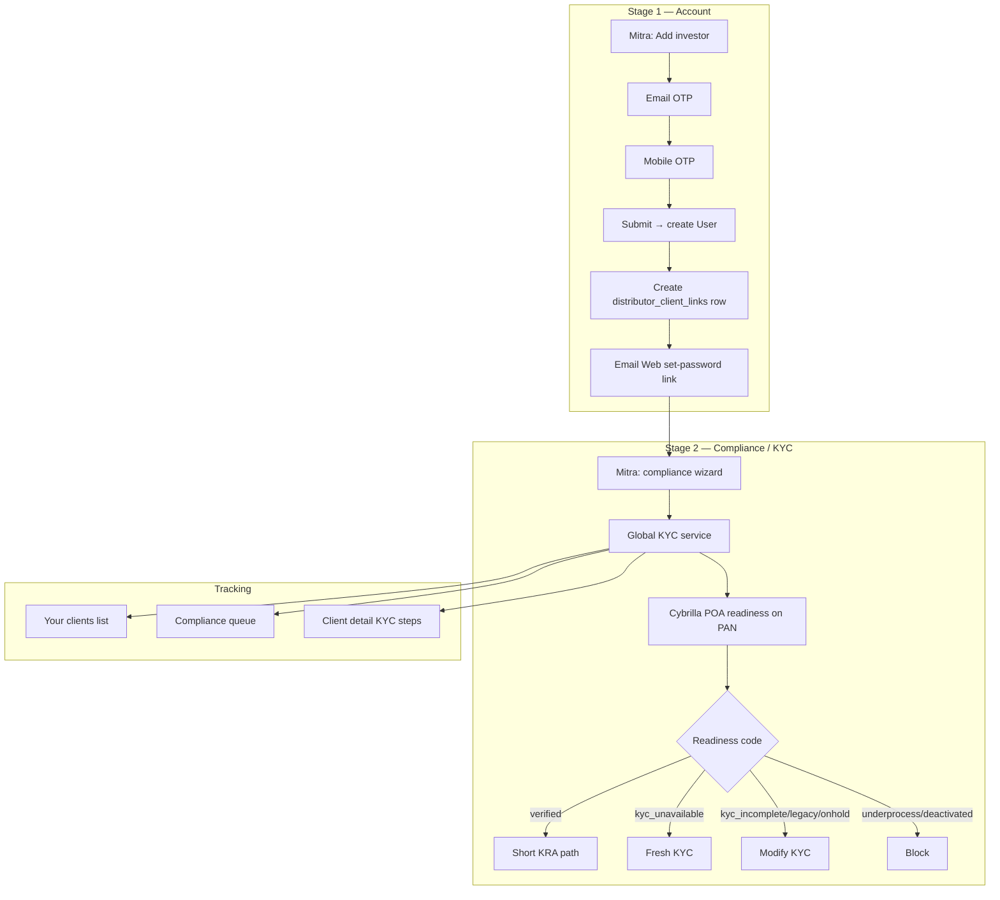

# Zynd Mitra — Investor onboarding, book, and compliance

This document describes how a **Zynd Mitra** (field distributor) or **Mitra Manager** adds investors, how clients are linked to the Mitra’s **Zynd Mitra code**, and how **Your clients** and **Compliance** stay in sync with the global KYC service.

---

## 1. Identity model

### Zynd Mitra code (book owner)

Every distributor-console persona receives a **persona client ID** stored on `users.client_id`:

| Persona | Format | Example |
|---------|--------|---------|
| Field Zynd Mitra | `ZYND-M-{initials}{series}` | `ZYND-M-HK001` |
| Mitra Manager | `ZYND-MG-{initials}{series}` | `ZYND-MG-NP001` |
| State / Super Head | `ZYND-D-{initials}{series}` | `ZYND-D-RS001` |

**When assigned**

- **Field Mitra** — on `POST /distributor/partners/onboarding/submit` (Add Zynd Mitra wizard).
- **Manager / State Head** — on admin invite accept (`assign_zynd_persona_client_id` by role).

The Mitra code is shown in the distributor console via `GET /distributor/console/context` → `client_id`, and in the session as `zyndClientId`.

### Zynd client code (investor)

Investors (Web/Mobile users) get a separate ID: `{emailLocal}{phoneDigits}@zynd` (e.g. `rahulsharma9876543210@zynd`). This is **not** the Mitra code — it identifies the investor account.

### Book link (Mitra ↔ investor)

Table: `distributor_client_links`

| Column | Purpose |
|--------|---------|
| `client_user_id` | Investor `users.id` (unique — one book per investor) |
| `mitra_user_id` | Field Mitra (or manager acting as book owner) |
| `mitra_client_id` | Denormalized `ZYND-M-…` for reporting and filters |
| `branch_id` | Branch at link time |
| `onboarded_by_user_id` | Who ran the add-investor flow |

**Rule:** Each investor is attached to exactly one Mitra book via `mitra_client_id`. Queries for **Your clients** filter on this link, not on all platform users.

---

## 2. End-to-end flow

### Stage 1 — Account onboarding (Mitra console)

**Duplicate prevention (Stage 1):** email and mobile are rejected if already registered on any active Zynd investor account (`email_already_registered`, `phone_already_registered`).

**Duplicate prevention (Stage 2 / global KYC):** PAN and verified bank accounts cannot be linked to more than one investor user (`pan_already_registered`, `bank_already_registered`). Enforced in `investor_identity_uniqueness_service.py` during `/kyc/pan/verify` and bank verification.

**Actor:** `mitra` or `mitra_manager` with `distributor.clients.onboard` and an assigned branch.

**API** (`/api/v1/distributor/clients/onboarding/…`):

1. `POST …/start` — email → OTP
2. `POST …/verify-email`
3. `POST …/send-mobile-otp` / `verify-mobile`
4. `POST …/submit` — creates investor user, assigns investor `client_id`, creates book link, sends **Web** password-reset email

**Password:** Server generates a random hash; investor sets password via Web reset link (not chosen by Mitra).

**Permissions:** `distributor.clients.onboard`

### Stage 2 — Compliance (global KYC)

**Subject:** investor `client_user_id`  
**Actor:** Mitra (delegated — routes to be extended under `/distributor/clients/{ref}/kyc/…`)

**Single backend engine:** `Backend/app/application/kyc/` — same services used by Web and Mobile self-service, with `user=` set to the **investor**, not the Mitra.

**Cybrilla POA readiness** (on PAN verify):

| Readiness | Action |
|-----------|--------|
| `verified` | Continue investment flow — short KRA path (skip DigiLocker / signature where applicable) |
| `kyc_unavailable` | Start **Fresh** KYC |
| `kyc_rejected` | Start **Fresh** KYC (product rule; align code with `journey_gate_service`) |
| `kyc_incomplete`, `kyc_legacy`, `kyc_onhold` | Start **Modify** KYC |
| `kyc_underprocess` | Block — show “KYC is currently under process.” |
| `kyc_deactivated` | Block — no investment, fresh, or modify |

DigiLocker rules (backend `requires_digilocker_for_readiness`):

- Required: `kyc_unavailable`, `kyc_incomplete`
- Skipped: KRA registered, `kyc_legacy`, `kyc_onhold`, `kyc_rejected`

---

## 3. Your clients tab

**API:** `GET /distributor/clients`  
**Permission:** `distributor.clients.list`

**Scoping:**

- **Field Mitra** — clients where `distributor_client_links.mitra_user_id = current user`
- **Mitra Manager** — clients linked to any **active** partner in the manager’s branch, plus the manager’s own book if they onboard directly

**Response fields (per client):**

- `client_id` — investor Zynd client code
- `mitra_client_id` — owning Mitra code (`ZYND-M-…`)
- `in_distributor_book` — always `true` for listed rows
- `compliance_status`, `onboarding_status`, `investment_status` — derived from KYC / investment state

**Detail:** `GET /distributor/clients/{reference}` includes `book_link` with `mitra_client_id`, `linked_at`, etc. Access denied if client is not in the actor’s book.

---

## 4. Compliance tab

**API:** `GET /distributor/compliance/queue`  
**Permission:** `distributor.compliance.list`

Builds a queue from **book clients** whose KYC is incomplete or blocked, using `kyc_journey_states` + `user_kyc_status`:

| Issue type | Typical trigger |
|------------|-----------------|
| KYC pending | PAN not verified, or journey in progress |
| eSign pending | `kyc_form_status == awaiting_esign` |
| Bank verification | `bank_verification_status == failed` |
| Nominee incomplete | Personal done, nominee missing |
| Compliance exception | `kyc_underprocess` / `kyc_deactivated` |

Same book filter as Your clients — Mitra only sees their queue.

---

## 5. Console context (profile)

**API:** `GET /distributor/console/context`

Returns:

- `client_id` — **Zynd Mitra code** for the logged-in user
- `phone_masked`
- `branch`, `branch_assigned`

The distributor UI reads `zyndClientId` and `phoneMasked` from the auth session (populated at login from this endpoint).

---

## 6. RBAC summary

| Permission | Mitra | Manager |
|------------|-------|---------|
| `distributor.clients.list` | ✓ | ✓ |
| `distributor.clients.read` | ✓ | ✓ |
| `distributor.clients.onboard` | ✓ | ✓ |
| `distributor.compliance.list` | ✓ | ✓ |
| `distributor.partners.manage` | — | ✓ |

---

## 7. Implementation map

| Area | Path |
|------|------|
| Book link model | `distributor_client_links` / `DistributorClientLink` |
| Link service | `distributor_client_link_service.py` |
| Client Stage 1 API | `client_onboarding_service.py`, `/distributor/clients/onboarding/*` |
| Client list/detail | `distributor_client_service.py` |
| Compliance queue | `distributor_compliance_service.py` |
| Persona IDs | `client_id_service.py` |
| Global KYC | `Backend/app/application/kyc/*`, `/kyc/*` |
| Distributor UI — clients | `Distributor/src/lib/distributor-clients-api.ts` |
| Distributor UI — compliance | `distributor-compliance-panel.tsx` |

---

## 8. Next steps (not yet implemented)

1. **Delegated KYC API** — `/distributor/clients/{ref}/kyc/*` wrapping existing KYC handlers with book access checks.
2. **Wire Add investor wizard** — replace demo (`add-investor-demo.ts`) with Stage 1 + Stage 2 APIs.
3. **Shared KYC rules package** — move readiness/journey logic to `@zynd/shared/kyc` for Web, Mobile, Distributor.
4. **Align `kyc_rejected`** — product Fresh vs current Modify mapping in `journey_gate_service.py`.
5. **Investment block** — enforce `kyc_deactivated` / `kyc_underprocess` in fund eligibility, not only at PAN verify.

---

## 9. Migration

Run Alembic revision `084_distributor_client_links` to create the book link table.

After deploy, re-seed or migrate RBAC so `mitra` / `mitra_manager` roles include `distributor.clients.onboard` and `distributor.compliance.list`.
